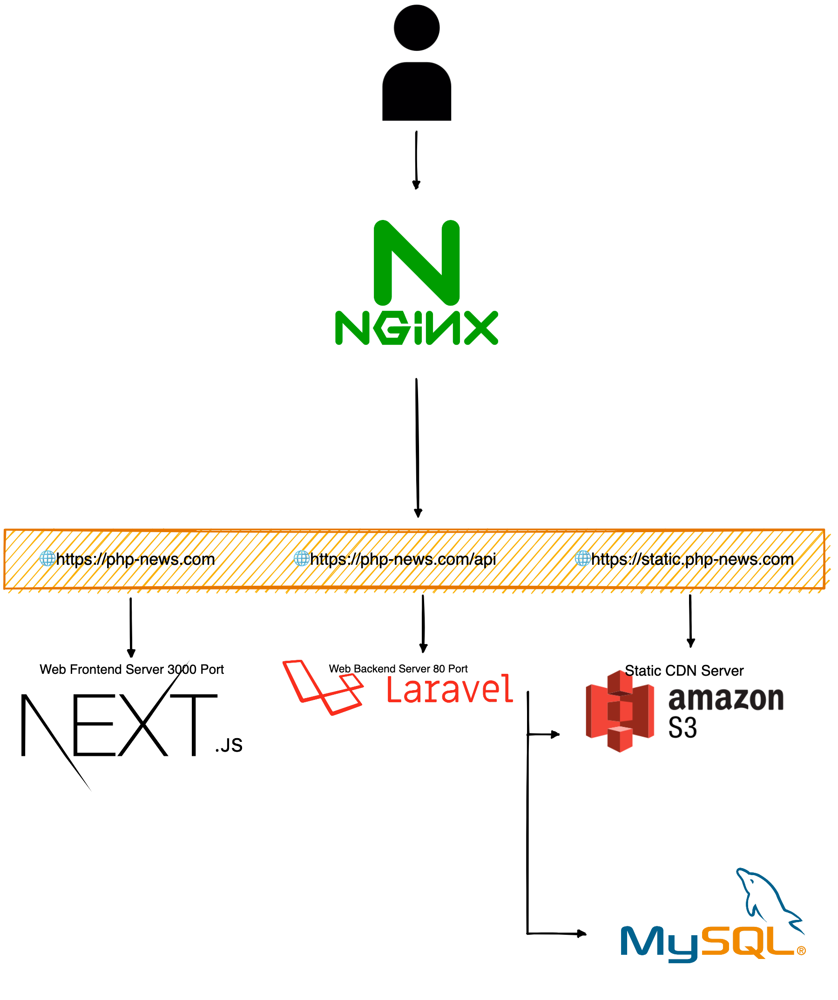
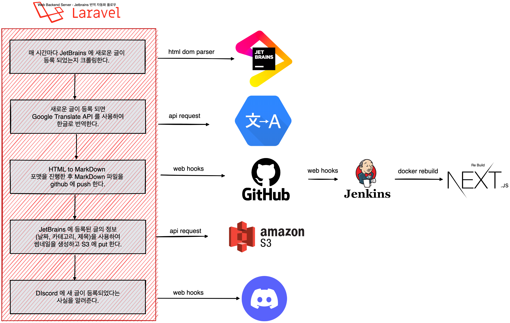

# JetBrains 번역 자동화

## 시작 방법

-- node 16 버전이 설치되어 있어야 합니다.

```bash
npm install
npm run dev
```

## 설명

JetBrains는 매달 php annotated 을 포스팅합니다.  
이 글을 한글로 번역하고, 개발자들끼리 토론을 하였으면 하는 그런 마음에 개발하게 되었습니다.
자세한 설명은 퇴근하고 다시 차차 정리 해야겠습니다.

## 구조

모든 서비스는 dockerize되어 있습니다. dockerize는 생략 합니다.

### 웹 서버



### 번역 자동화 플로우


